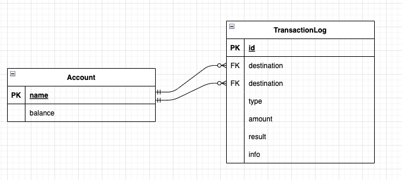

# Banking System for Demo

## How to start the project ?

```bash
$ git clone xxxxxx
$ npm install
$ docker compose up
# server is running on http://localhost:4000
```

## How to run test ?

```bash
# run database(mysql:8) by docker image
$ docker run --name banking-system-demo-mysql -p 3306:3306 -e MYSQL_ROOT_PASSWORD=123 -d mysql:8

# run test
$ npm run test
```

## Detail about the project

### API doc

- http://localhost:4000/api/docs

### Data Schema


